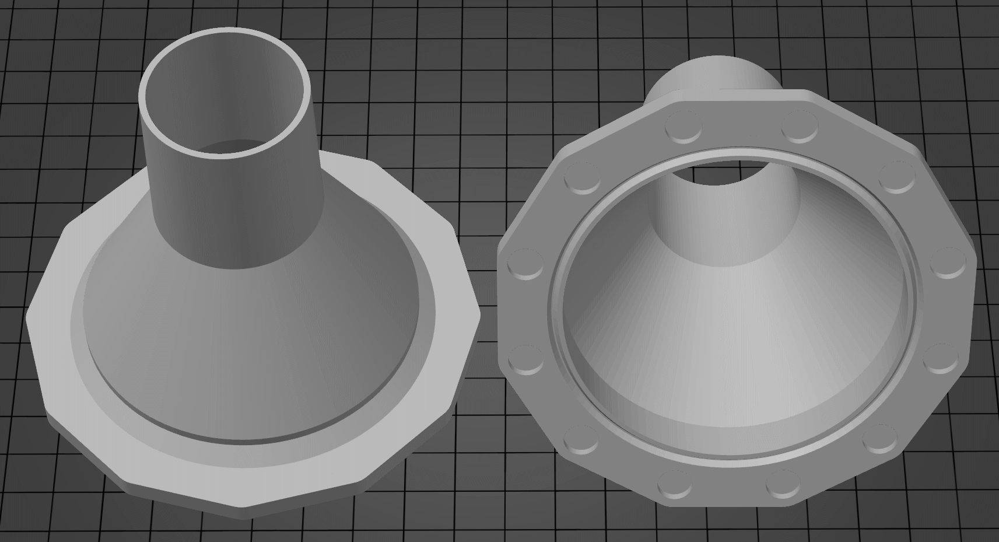
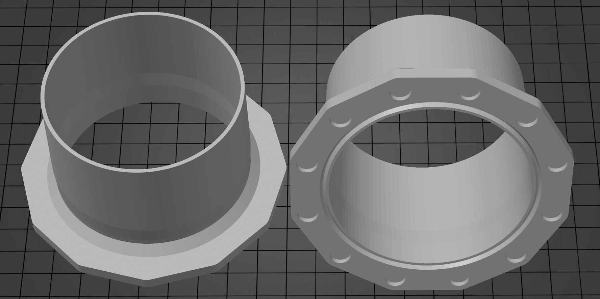
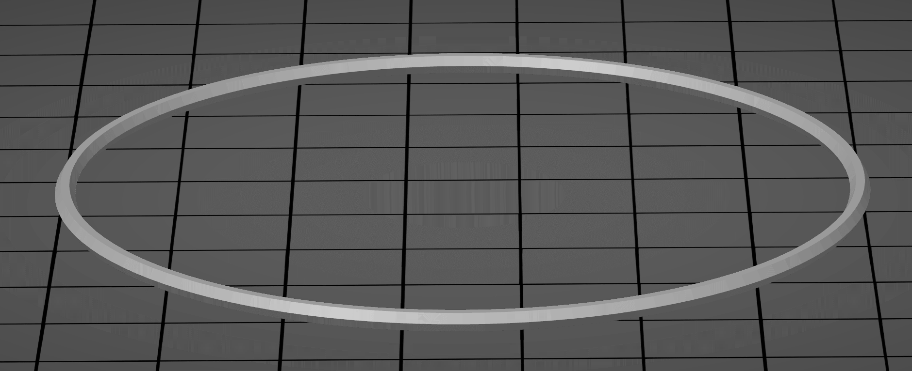

# Vacuum hose adapters for OpenSCAD

This is a collection of OpenSCAD modules that allow you to easily design and 3D
print adapters for pipes and tubes of various sizes. The main utilization of
these adapters is to connect a vacuum hose to a variety of different tools and
devices, such as power tools, sanders, and dust collectors.

This highly parametric module lets you create create custom adapters that
perfectly fit the dimensions of your vacuum hose and the tool or device you want
to connect it to. Besides fitting the dimensions, it is also possible to design
the adapters with a tapered shape that ensures a secure and snug fit, preventing
any air leaks that might reduce the suction power of your vacuum.

## Connection types

Four different types of connections are possible to maximize the number of
applications possible.

### Hose connection
Intended for connection between two hoses or a hose and a tool exhaust.

#### Main settings
* Diameter: Internal or external diameter of the intended connector.
* Length: The length of the connection end.
* Taper: the hose connection can be tapered to allow for a tighter fit.

### Flat connection
Intended for connection to a tool. To achieve this the transition section is set
to flat, the transition length becomes the thickness. The flat area will be from
connector1Diameter to connector2Diameter.

#### Main settings
* TransitionStyle: **flat**
* TransitionLength: Thickness of the flat area.

### Magnetic flange connection
Intended for creating a quick removable connection that holds in place using
magnets. Perfect for quick connect/disconnect to large shop equipment.

The magnets should be slightly recessed so that the two faces get a good seal,
allow extra depth if you want to avoid supports. Usually 8 10mm x 1.5mm magnets
seem sufficient to hold a 50mm connector for a shopvac.

#### Magnet polarity
If you plan on connecting two magnetic flanges together, pay attention to the
polarities of your magnets. A good way to ensure connection would be to
**alternate the polarity** when gluing the magnets. That way it will always be
possible to connect any magnetic flange to an other one.

#### Alignment ring
An alignment ring can be added to help align the duct and reduce air leakage.
Ideally, the flange should be created with a small recess to accept the ring.
The most optimal solution would be to print the ring in flexible material (TPU).

Although, this does not appear to be required to have a good suction.

#### CTS Cen-Tec Quick-connect
An connector 2 adapter for CTS Cen-Tec quick-connect hoses (see https://www.centecsystems.com/quick-click-dust-collection/). 
The stubby Cen-Tec adapter comes from an existing STL model (https://www.thingiverse.com/thing:4739202), but had to be remixed in Meshmixer to resolve a non-manifold fault in the STL - the resultant new STL is quite large and has been ZIP'd for Github.
A better solution would be to design the Cen-Tec adapter from scratch in OpenSCAD but this solution works OK for now.

#### Main settings
**Changing any of the settings** (diameter, magnet size, alignment ring...)
**will change the magnet position and flange size**.
A good practice would be to save the configuration of the hose in JSON using the
`save preset` option in OpenSCAD. See [the OpenSCAD
documentation][openscad_save_params] for more information.

* Flange diameter: Internal diameter of the flange connection.
* Flange thickness: The overall thickness of the flange. Magnet thickness plus
  4mm seem to work well.
* Connector length: The length of the connector before the tapered section will
  start.
* Magnet count: Number of magnets to be added to the flange.
* Magnet diameter: Diameter of the magnets (add 0.5 to measurement).
* Magnet border: The amount material around the magnet.
* Magnet thickness: Thickness of the magnets (add 0.5 to measurement, 1.0 to
  avoid supports).
* lip: If an alignment ring should be supported, can be recessed or protruding,
  suggest recessed.

## Sample files
The file [vacuum-hose-adapter-samples.scad](vacuum-hose-adapter-samples.scad
"more info"), has a few sample configurations to highlight the intended usages.

### 50mm hose to 30mm hose
An adapter to connect a 50mm (internal diameter) hose to a 30mm (internal
diameter) hose. A stop is added to the larger 50mm side, so the adapter does not
get pulled in to the hose. Both ends have a small taper to ensure snug fit. 

### 50mm hose to 100mm hose
An adapter to connect a 50mm (internal diameter) hose to a 100mm (internal
diameter) hose. A stop is added to the larger 100mm side, so the adapter does
not get pulled in to the hose. Both ends have a small taper to ensure snug
fit. 

### Flat plate to 50mm hose
An adapter to connect a 50mm (internal diameter) host to the side of a something
else such as a large tool or machine. The end has a small taper. 

### 50mm magnet to 40mm
A 50mm magnetic adapter to a 40mm hose. The magnetic flange has space for 8 10mm
x 2mm magnets (magnet holes are 10.5mm x 2.5mm). There is a recessed ring for an
alignment ring. The 40mm end has a 2mm taper. 

### 50mm magnet to 100mm
A 50mm magnetic adapter to a 100mm hose. The magnetic flange has space for 8
10mm x 2mm magnets (magnet holes are 10.5mm x 2.5mm). There is a recessed ring
for an alignment ring. The 100mm end has a 2mm taper. 

### 50mm magnet to flat plate with 30mm connector
A 50mm magnetic adapter to flat plate with 30mm connector. The magnetic flange
has space for 8 10 mm x 2mm magnets (magnet holes are 10.5mm x 2.5mm). This can
be used to for connecting to a tool that would have a hole the size of the
connector. 

### 50mm magnet to flat plate
A 50mm magnetic adapter to flat plate. The magnetic flange has space for 8 10mm
x 2mm magnets (magnet holes are 10.5mm x 2.5mm). This can be used as an
attachment point on the side of tool box. 

### 50mm magnet flange alignment ring
A alignment ring that fits in the recess on 50mm magnetic adapter. Ideally this
would be printed in a soft plastic like TPU so it can act as a seal. The ring is
slightly smaller in width and height to allow for imperfections in the print. I
found its not really needed. 

### 100mm magnet flange to 50mm hose
A 100mm magnetic adapter to a 50mm hose. The magnetic flange has space for 12
10mm x 2mm magnets (magnet holes are 10.5mm x 2.5mm). There is a recessed ring
for an alignment ring. The 50mm end has a 2mm taper and a hose stop. 

### 100mm magnet flange to 100mm hose
A 100mm magnetic adapter to a 100mm hose adapter. The magnetic flange has space
for 12 10mm x 2mm magnets (magnet holes are 10.5mm x 2.5mm). There is a recessed
ring for an alignment ring. The 100mm end has a 2mm taper and a hose stop. 

### 100m magnet flange alignment ring
A alignment ring that fits in the recess on 100mm magnetic adapter. Ideally this
would be printed in a soft plastic like TPU so it can act as a seal. The ring is
slightly smaller in width and height to allow for imperfections in the print. I
found its not really needed. 

### 50mm magnet to 100mm magnet
A 50mm magnetic connector to a 100mm magnetic flange. Allowing connection
between different sized magnetic connectors. 

[openscad_save_params]:https://en.wikibooks.org/wiki/OpenSCAD_User_Manual/Customizer#GUI
