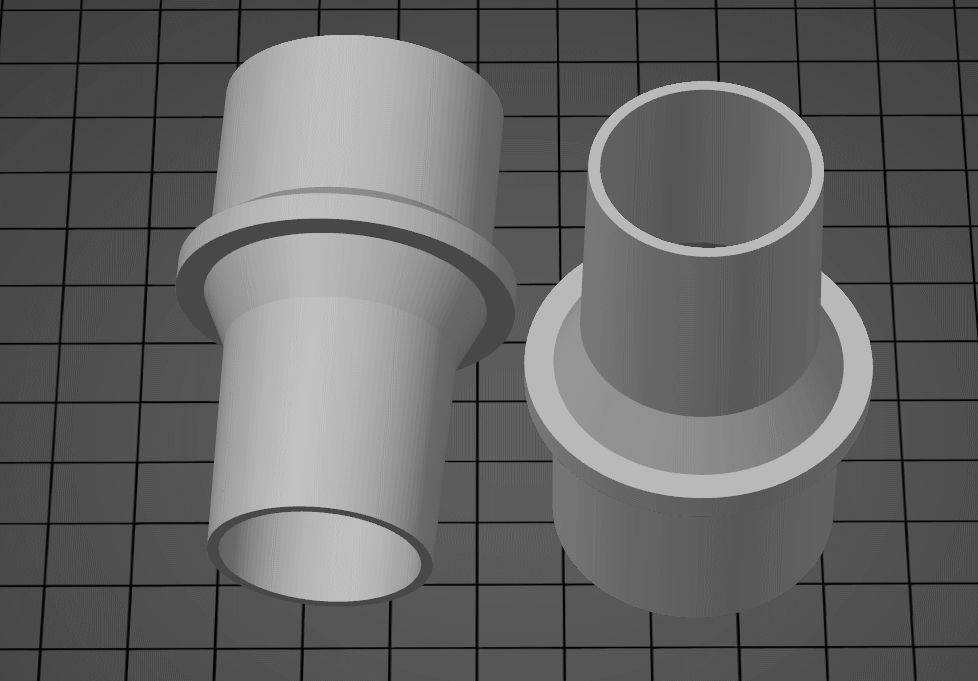
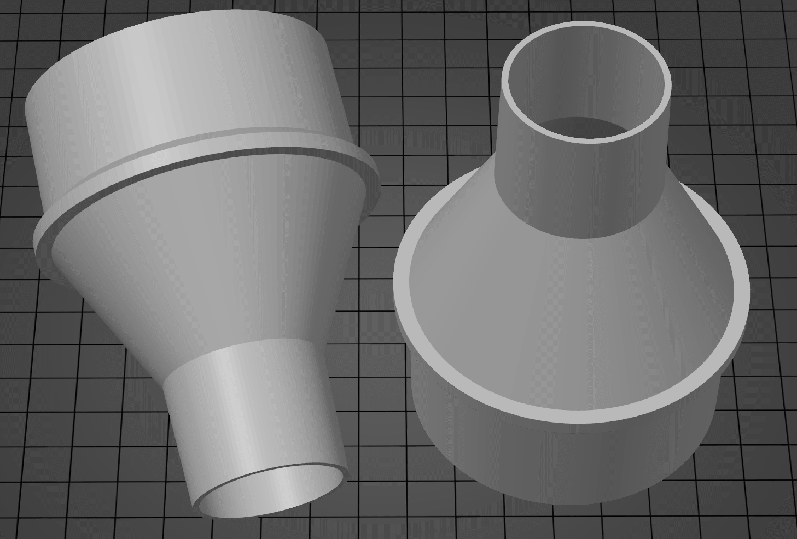
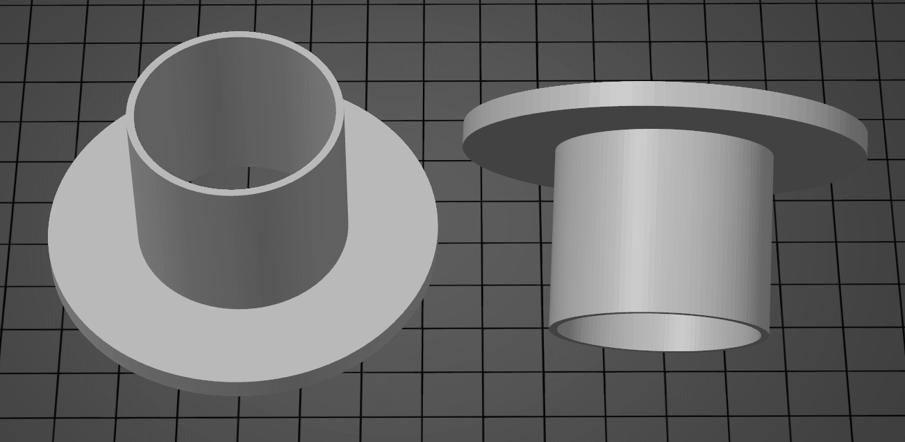
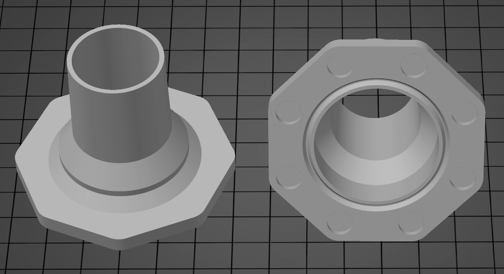
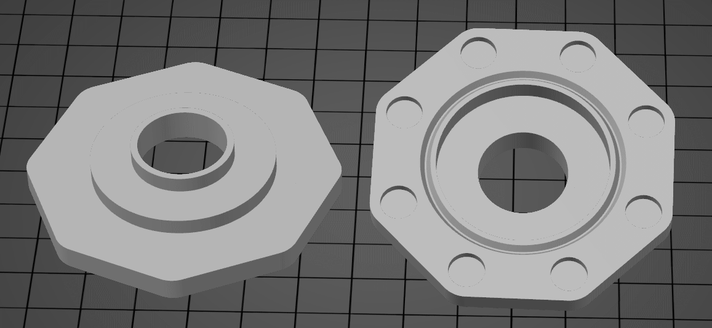
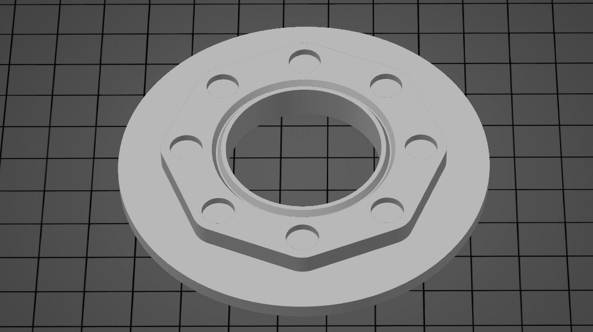
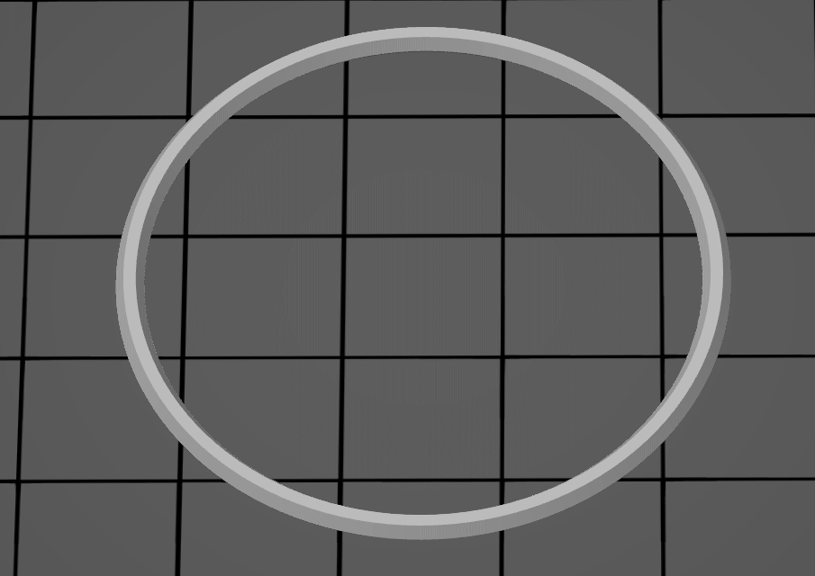
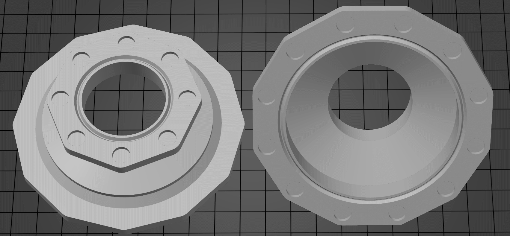

# OpenSCAD project to create vacuum hose connectors.

Intended for generating connections that would allow connecting vacuum hoses and
tools of different diameters together.

Parametrises settings support a few connections types. The connections types can
be used on ether end of the adapter.

## Hose connection
Intended for connection to a hose or a tool.

Main setting:
* Diameter: Internal or external diameter of the intended connector. If your
  hose has a 50mm internal
* Length: The length of the connection end.
* Taper: the hose connection can be tapered to allow for a tighter fit.

## Flat connection
Intended for connection to a tool. To achieve this the transition section is set
to flat, the transition length becomes the thickness. The flat area will be from
connector1Diameter to connector2Diameter.
* TransitionStyle: **flat**
* TransitionLength: Thickness of the flat area.

## Magnetic flange connection
Intended for creating a quick removable connection. Allowing the hose to be
quickly moved form device to device. The magnets should be slightly recessed so
that the two faces get a good seal, allow extra depth if you want to avoid
supports.

8 10mm x 1.5mm magnets seem sufficient to hold a 50mm connector for a shopvac.

Regarding magnets you will need opposite polarities for the faces to attract.
Suggest that each connector has alternating polarity, half positive half
negative, this way all connectors will attract.

An alignment ring can be added to help alignment and air leakage. Suggest the
flange include a recess for the ring, then if wanted you can print a ring in TPU
to assist with air leakage. Does not appear to be required.

Note, changing any of the settings (diameter, magnet size, alignment ring...)
will change the magnet position and flange size. Suggest settings are written
down for future connectors.

Main setting:
* Flange diameter: Internal diameter of the flange connection.
* Flange thickness: The overall thickness of the flange. Magnet thickness plus
  4mm seem to work well.
* Connector length: The length of the connector before the tapered section will
  start.
* Magnet count: Number of magnets to be added to the flange.
* Magnet diameter: Diameter of the magnets (add 0.5 to measurement).
* Magnet border: The amount material around the magnet.
* Magnet thickness: Thickness of the magnets (add 0.5 to measurement, 1.0 to
  avoid supports).
* lip: If an alignment ring should be supported, can be recessed or protruding,
  suggest recessed.

## **Sample generated STL**
The file [vacuum-hose-adapter-samples.scad](vacuum-hose-adapter-samples.scad
"more info"), has a few sample configurations to highlight the intended usages.

### **50mm hose to 30mm hose**
An adapter to connect a 50mm(inner hose measurement) hose to a 30mm(internal
hose measurement) hose. A stop is added to the larger 50mm side, so the adapter
does not get pulled in to the hose. Both ends have a small taper. 

### **50mm hose to 100mm hose**
An adapter to connect a 50mm(inner hose measurement) hose to a 100mm(internal
hose measurement) hose. A stop is added to the larger 100mm side, so the adapter
does not get pulled in to the hose. Both ends have a small taper. 

### **Flat plate to 50mm hose**
An adapter to connect a 50mm(inner hose measurement) to the side of a something,
a tool perhaps. The end has a small taper. 

### **50mm magnet to 40mm**
An 50mm magnetic adapter to a 40mm hose adapter. The magnetic flange has space
for 8 10mmx2mm magnets (magnet holes are 10.5mm x 2.5mm). There is a recessed
    ring for an *o-ring*. The 40mm end has a 2mm taper. 

### **50mm magnet to 100mm**
An 50mm magnetic adapter to a 100mm hose adapter. The magnetic flange has space
for 8 10mmx2mm magnets (magnet holes are 10.5mm x 2.5mm). There is a recessed
ring for an *o-ring*. The 100mm end has a 2mm taper. 

### **50mm magnet to flat plate with 30mm connector**
An 50mm magnetic adapter to flat plate with 30mm connector. The magnetic flange
has space for 8 10mmx2mm magnets (magnet holes are 10.5mm x 2.5mm). Intended for
connecting to a tool, that would have a hole the size of the connector. 

### **50mm magnet to flat plate**
An 50mm magnetic adapter to flat plate. The magnetic flange has space for 8
10mmx2mm magnets (magnet holes are 10.5mm x 2.5mm). Intended for connecting to
the side of a tool or box. 

### **50m magnet flange alignment ring**
An alignment ring that fits in the to recess on 50mm magnetic adapter. The
intent would be to print this in a soft plastic like TPU so it can act as a
seal. The ring is slightly smaller in width and height to allow for imperfection
in the print. I found its not really needed. 

### **100m magnet flange to 50mm hose**
An 100mm magnetic adapter to a 50mm hose adapter. The magnetic flange has space
for 12 10mmx2mm magnets (magnet holes are 10.5mm x 2.5mm). There is a recessed
    ring for an *o-ring*. The 50mm end has a 2mm taper and a hose stop. 

### **100m magnet flange to 100mm hose**
An 100mm magnetic adapter to a 100mm hose adapter. The magnetic flange has space
for 12 10mmx2mm magnets (magnet holes are 10.5mm x 2.5mm). There is a recessed
ring for an *o-ring*. The 100mm end has a 2mm taper and a hose stop. 

### **100m magnet flange alignment ring**
An alignment ring that fits in the to recess on 100mm magnetic adapter. The
intent would be to print this in a soft plastic like TPU so it can act as a
seal. The ring is slightly smaller in width and height to allow for imperfection
in the print. I found its not really needed. 

### **50mm magnet to 100mm magnet**
An 50mm magnetic connector to a 100mm magnetic connector. Allowing connection
between different sized magnetic connectors. 

